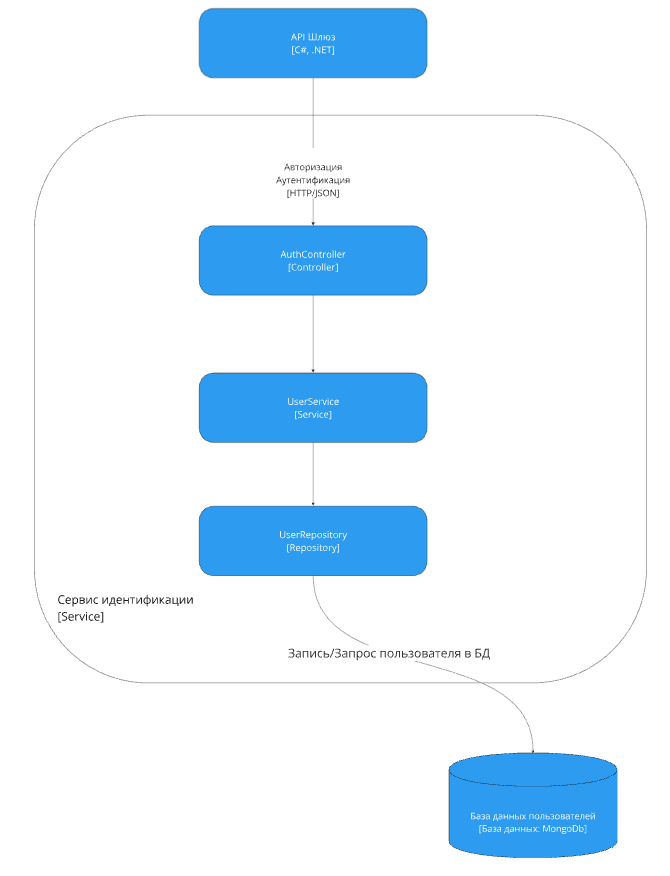
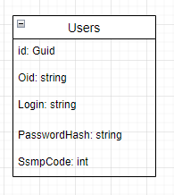

# Лабораторная работа 3

## 1. Диаграмма компонентов 
Сервис идентификации и работы с иногородними пациентами



## 3. Модель базы данных



* База данных содержит всего 1 модель для пользователей системой.

## 4. Применение основных принципов разработки
    
#### Контроллер
```
    public class AuthController : Controller
{
    private readonly IUserService _userService;

    public AuthController(IUserService userService)
    {
        _userService = userService;
    }

    [HttpGet]
    [Route("/get_users")]
    public async Task<IActionResult> GetUsers()
    {
        return Ok(await _userService.GetUsers());
    }

    [HttpPost]
    [Route("/auth")]
    public async Task<IActionResult> Login([FromBody] RequestLoginModel loginModel)
    {
        var result = await _userService.Authorization(loginModel.Oid, loginModel.Login, loginModel.Password);
        var dto = new DtoWrapper<ResponseLoginModel>().CreateDTO(result);
        return Ok(dto);
    }

    [HttpPost]
    [Route("/create")]
    public async Task<IActionResult> Create([FromBody] RequestLoginModel loginModel)
    {
        var result = await _userService.Create(loginModel.Oid, loginModel.Login, loginModel.Password);
        var dto = new DtoWrapper<bool>().CreateDTO(result);
        return Ok(dto);
    }

    [HttpDelete]
    [Route("/delete")]
    public async Task<IActionResult> Delete(string id)
    {
        var result = await _userService.Delete(id);
        return Ok(result);
    }

}
```

#### Интерфейс сервиса и его реализация
```
    public interface IUserService
    {
    Task<List<User>> GetUsers();
    Task<OperationResult<ResponseLoginModel>> Authorization(string OID, string login, string password);

    Task<OperationResult<bool>> Create(string OID, string login, string password);
    Task<bool> Delete(string id);
    }


    public class UserService : IUserService
    {
    private readonly IUserRepository _userRepository;
    private readonly ILogger<UserService> _logger;

    public UserService(IUserRepository userRepository, ILogger<UserService> logger)
    {
        _userRepository = userRepository;
        _logger = logger;
    }

    public async Task<List<User>> GetUsers()
    {
        return await _userRepository.GetList();
    }

    public async Task<OperationResult<ResponseLoginModel>> Authorization(string OID, string login, string password)
    {
        OperationResult<ResponseLoginModel> result = new OperationResult<ResponseLoginModel>();
        try
        {
            // product code
                result.AddResult(model);
                result.AddSuccess("Авторизация выполнена успешно");

                return result;
            }
            else
            {
                result.AddFail("Доступ запрещен", OperationInfo.Warning);
                return result;
            }
        }
        catch (Exception ex)
        {
            _logger.LogError(ex.Message);
            result.AddFail("Серверная ошибка", OperationInfo.Error);
            return result;
        }
    }

    public async Task<OperationResult<bool>> Create(string OID, string login, string password)
    {
        OperationResult<bool> result = new OperationResult<bool>();
        try
        {
            // product code
            await _userRepository.Create(user);
            result.AddResult(true);
            result.AddSuccess("Пользователь добавлен");
            return result;
        }
        catch (Exception ex)
        {
            Console.WriteLine(ex.Message);
            result.AddFail("Серверная ошибка, пользователь не добавлен", OperationInfo.Error);
            return result;
        }
    }

    public async Task<bool> Delete(string id)
    {
        return await _userRepository.Detele(id);
    }
}
```

#### Интерфейс репозитория и его реализация
```
    public interface IUserRepository
    {
    Task<List<User>> GetList();
    Task<bool> Create(User user);
    Task<User> Get(User user);
    Task<User> GetByLogin(string login);
    Task<bool> Detele(string id);
    }

    public class UserRepository : IUserRepository
{
    readonly IMongoCollection<User> _user;

    public UserRepository(IMongoClient mongoClient, DatabaseSettings DatabaseSettings)
    {
        var database = mongoClient.GetDatabase(DatabaseSettings.DatabaseName);
        _user = database.GetCollection<User>(DatabaseSettings.UserCollection);
    }

    public async Task<List<User>> GetList()
    {
        return await _user.Find(_ => true).ToListAsync();
    }

    public async Task<bool> Create(User user)
    {
        await _user.InsertOneAsync(user);
        return true;
    }

    public async Task<User> Get(User user)
    {
        var userFind = await _user.Find(u => u.OID == user.OID && u.Login == user.Login && u.PasswordHash == user.PasswordHash).FirstOrDefaultAsync();
        return userFind;
    }

    public async Task<User> GetByLogin(string login)
    {
        var user = await _user.Find(u => u.Login == login).FirstOrDefaultAsync();
        return user;
    }

    public async Task<bool> Detele(string id)
    {
        DeleteResult deleteResult = await _user.DeleteOneAsync(c => c.Id == id);

        return deleteResult.DeletedCount > 0;
    }
}
```


1. KISS (Keep It Simple, Stupid):
Принцип KISS гласит, что программное обеспечение должно быть максимально простым, понятным и не содержать избыточных элементов. Контроллер `AuthController` представляет простые методы для работы с пользователями системы, скрывая сложность реализации в `UserService`.

2. DRY (Don't Repeat Yourself)
Принцип DRY говорит о том, что необходимо избегать дублирования кода. Логика валидации данных пользователя и обработки результата вынесены в отдельный метод, что позволяет избежать повторения кода

3. SOLID (Принципы SOLID)
Принципы SOLID - это набор принципов проектирования ПО, которые делают код более понятным, гибким и легко расширяемым.
    * Принцип Единственной Ответственности (Single Responsibility Principle):

        * Контроллер `AuthController` отвечает за обработку HTTP запросов и вызовы сервиса для выполнения операций с пользователями. Сервис `UserService` отвечает за бизнес-логику операций с пользователями и валидацию данных.
    * Принцип Открытости/Закрытости (Open/Closed Principle):
        * Код не является слишком закрытым для расширения. Например, при добавлении новых операций над пользователями или новых проверок данных, необходимо будет изменить соответствующие методы в сервисе `UserService`, но это вполне ожидаемо для изменения бизнес-логики.
    * Принцип Подстановки Барбары Лисков (Liskov Substitution Principle):
        * Принцип LSP говорит о том, что объекты одного класса могут быть заменены объектами другого подкласса без изменения свойств программы. В данном коде не используется
    * Принцип Разделения Интерфейса (Interface Segregation Principle):
        * В коде нет явного использования интерфейсов, которые могли бы разделить большие интерфейсы на более мелкие и специализированные. Но этот принцип может быть не так важен в случае с контроллерами и сервисами.
    * Принцип инверсии зависимостей (Dependency Inversion Principle):
        * Классы `AuthController` и `UserService` используют интерфейсы для взаимодействия с зависимостями (`IUserRepository `, `ILogger`). Это соответствует принципу DIP.

4. YAGNI (You Aren't Gonna Need It):
Принцип YAGNI утверждает, что не нужно добавлять в код функциональность, которая не требуется на текущий момент:
    * Контроллер AuthController:
        * Контроллер содержит только методы для базовых операций CRUD. Это соответствует принципу YAGNI, поскольку реализует только то, что необходимо на данный момент.
