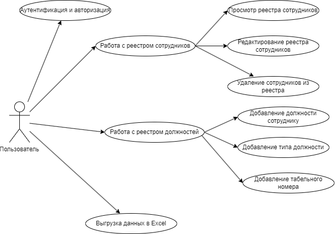

# Лабораторная работа 1 

## 1. Перечень заинтересованных лиц
* Старшие фельдшеры СМП - основные пользователи системы, будут осуществлять просмотр, редактирование, добавление и измениения реестра сотрудников и должностей.

## 2. Функциональные требования
1. **Доступ к системе:**
    * Аутентификация и авторизация пользователей в системе
2. **Работа с Реестром сотрудников:**
    * Просмотр реестра сотрудников
    * Редактирование реестра сотрудников
    * Удаление сотрудников из реестра
3. **Работа с должностью:**
    * Добавление должности сотруднику
    * Добавление типа должности
    * Добавление уникального табельного номера к должности
4. **Выгрузка данных:**
    * Выгрузка данных по всем сотрудникам в Execel формате

## 3. Диаграмма вариантов использования для функциональных требований

## 4. Перечень сделанных предположений
* Разработать систему локального хранения реестра медицинских работников, в связи с невозможностью интеграции с все российской системой
* Необходимо разработать и развернуть систему, которая будет доступна только в закрытой сети, на разных станция скорой помощи (в разных городах)

## 5. Нефункциональные требования

* Безопасность - данные мед. работников должны храниться в защищенной базе данных, доступ к системе должны иметь ограниченное число пользователей
* Масштабируемость - со временем мед. работники станут занимать много место, необходимо масштабировать базу данных карт вызовов